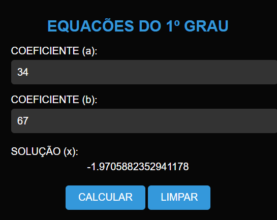

# EQUACÕES DO 1 GRAU
🆎APLICAÇÃO QUE CALCULA EQUACÕES DO 1º GRAU EM HTML, CSS E JS.

  

## DESCRIÇÃO:
Este projeto consiste em uma calculadora de equações do primeiro grau que permite aos usuários encontrar a solução para uma equação do tipo ax + b = 0. Aqui estão as principais funcionalidades implementadas:

1. Inserir Coeficientes:
   - Os usuários podem inserir os coeficientes "a" e "b" da equação nos campos correspondentes.

2. Calcular:
   - Ao clicar no botão "CALCULAR", o sistema calculará a solução da equação e exibirá o resultado abaixo.

3. Limpar Campos:
   - O botão "LIMPAR" permite que os usuários limpem os campos de entrada e o resultado calculado, facilitando a inserção de novos coeficientes.

## EXECUTANDO O PROJETO:
1. Inserir Coeficientes:
   - Digite os coeficientes "a" e "b" da equação nos campos correspondentes.

2. Calcular:
   - Clique no botão "CALCULAR" para encontrar a solução da equação.
   - A solução será exibida abaixo dos campos de entrada.

3. Limpar:
   - Se desejar limpar os campos de entrada e a solução, clique no botão "LIMPAR".
   - Isso restaurará os campos de entrada para seus valores padrão e removerá a solução exibida.
   
## NÃO SABE?
- Entendemos que para manipular arquivos em `HTML`, `CSS` e outras linguagens relacionadas, é necessário possuir conhecimento nessas áreas. Para auxiliar nesse aprendizado, oferecemos cursos gratuitos disponíveis:
* [CURSO DE HTML E CSS](https://github.com/VILHALVA/CURSO-DE-HTML-E-CSS)
* [CURSO DE JAVASCRIPT](https://github.com/VILHALVA/CURSO-DE-JAVASCRIPT)
* [CONFIRA MAIS CURSOS](https://github.com/VILHALVA?tab=repositories&q=+topic:CURSO)

## CREDITOS:
- [PROJETO CRIADO PELO VILHALVA](https://github.com/VILHALVA)

